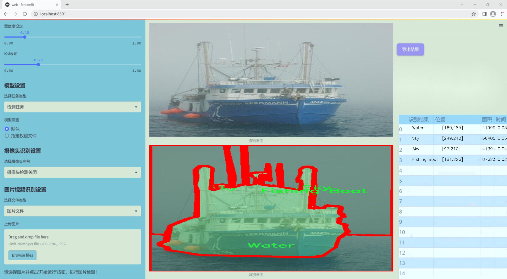

### 1.背景意义

研究背景与意义

随着全球水上交通的迅速发展，水域安全和交通管理日益成为各国政府和相关机构关注的重点。水上交通物体检测技术的进步，尤其是在实时监测和识别方面，对于提高水上交通的安全性、减少事故发生率具有重要意义。传统的水上交通监测方法多依赖人工巡逻和简单的传感器，这不仅效率低下，而且容易受到人为因素的影响。近年来，深度学习技术的快速发展为水上交通物体检测提供了新的解决方案。

YOLO（You Only Look Once）系列模型因其高效的实时检测能力而广泛应用于各类物体检测任务。YOLOv11作为该系列的最新版本，具备更强的特征提取能力和更快的推理速度，能够在复杂的水上环境中准确识别多种类型的交通物体。通过对YOLOv11的改进，可以进一步提升其在水上交通场景中的应用效果，从而实现更为精准的物体检测。

本研究所使用的数据集包含1300张图像，涵盖了包括浮标、商业船只、渔船、乘客船、动力艇、帆船等在内的16个类别。这些类别的多样性使得模型在训练过程中能够学习到丰富的特征，从而提高其在实际应用中的泛化能力。此外，数据集中对物体的精确标注为模型的训练提供了可靠的基础，有助于提升检测的准确性和鲁棒性。

通过构建基于改进YOLOv11的水上交通物体检测系统，研究将为水上交通的智能化管理提供技术支持，推动水上交通安全监测的自动化进程。这不仅有助于提升水域安全，还将为相关领域的研究和应用提供新的思路和方法，具有重要的理论价值和实际意义。

### 2.视频效果

[2.1 视频效果](https://www.bilibili.com/video/BV122kuYDELd/)

### 3.图片效果




##### [项目涉及的源码数据来源链接](https://kdocs.cn/l/cszuIiCKVNis)**

注意：本项目提供训练的数据集和训练教程,由于版本持续更新,暂不提供权重文件（best.pt）,请按照6.训练教程进行训练后实现上图演示的效果。

### 4.数据集信息

##### 4.1 本项目数据集类别数＆类别名

nc: 13
names: ['Buoy-Marker', 'Commercial Vessel', 'Fishing Boat', 'Land', 'Other Obstacle', 'Passenger Vessel', 'Person', 'Powerboat', 'Sailboat', 'Sky', 'Small Craft', 'Water', 'Yacht-sail-pow-']


该项目为【图像分割】数据集，请在【训练教程和Web端加载模型教程（第三步）】这一步的时候按照【图像分割】部分的教程来训练

##### 4.2 本项目数据集信息介绍

本项目数据集信息介绍

本项目旨在改进YOLOv11的水上交通物体检测系统，为此我们构建了一个丰富且多样化的数据集，名为“reconserve-seg”。该数据集专注于水上交通场景，涵盖了多种类别的物体，以确保模型在实际应用中的准确性和鲁棒性。数据集中共包含13个类别，具体包括：Buoy-Marker（浮标标记）、Commercial Vessel（商业船舶）、Fishing Boat（渔船）、Land（陆地）、Other Obstacle（其他障碍物）、Passenger Vessel（客船）、Person（人）、Powerboat（动力艇）、Sailboat（帆船）、Sky（天空）、Small Craft（小型船只）、Water（水面）以及Yacht-sail-pow-（游艇）。这些类别的选择不仅考虑到了水上交通的多样性，还兼顾了不同环境和条件下可能出现的各种物体。

在数据集的构建过程中，我们通过精心采集和标注，确保每个类别的样本数量充足且具有代表性。每个类别的图像均经过严格筛选，以保证其在不同光照、天气和水面状态下的表现，从而提高模型的泛化能力。此外，数据集还包括了多种场景下的图像，例如繁忙的港口、宁静的湖泊以及开阔的海域，旨在模拟真实世界中的复杂情况。这种多样性将为YOLOv11的训练提供坚实的基础，使其能够更好地识别和分类水上交通中的各种物体。

通过使用“reconserve-seg”数据集，我们期望能够显著提升YOLOv11在水上交通物体检测任务中的性能，进而为水上安全和交通管理提供更为有效的技术支持。该数据集的构建不仅为学术研究提供了宝贵的资源，也为实际应用中的智能监控系统奠定了基础。


### 5.全套项目环境部署视频教程（零基础手把手教学）

[5.1 所需软件PyCharm和Anaconda安装教程（第一步）](https://www.bilibili.com/video/BV1BoC1YCEKi/?spm_id_from=333.999.0.0&vd_source=bc9aec86d164b67a7004b996143742dc)


[5.2 安装Python虚拟环境创建和依赖库安装视频教程（第二步）](https://www.bilibili.com/video/BV1ZoC1YCEBw?spm_id_from=333.788.videopod.sections&vd_source=bc9aec86d164b67a7004b996143742dc)

### 6.改进YOLOv11训练教程和Web_UI前端加载模型教程（零基础手把手教学）

[6.1 改进YOLOv11训练教程和Web_UI前端加载模型教程（第三步）](https://www.bilibili.com/video/BV1BoC1YCEhR?spm_id_from=333.788.videopod.sections&vd_source=bc9aec86d164b67a7004b996143742dc)


按照上面的训练视频教程链接加载项目提供的数据集，运行train.py即可开始训练



     Epoch   gpu_mem       box       obj       cls    labels  img_size
     1/200     20.8G   0.01576   0.01955  0.007536        22      1280: 100%|██████████| 849/849 [14:42<00:00,  1.04s/it]
               Class     Images     Labels          P          R     mAP@.5 mAP@.5:.95: 100%|██████████| 213/213 [01:14<00:00,  2.87it/s]
                 all       3395      17314      0.994      0.957      0.0957      0.0843

     Epoch   gpu_mem       box       obj       cls    labels  img_size
     2/200     20.8G   0.01578   0.01923  0.007006        22      1280: 100%|██████████| 849/849 [14:44<00:00,  1.04s/it]
               Class     Images     Labels          P          R     mAP@.5 mAP@.5:.95: 100%|██████████| 213/213 [01:12<00:00,  2.95it/s]
                 all       3395      17314      0.996      0.956      0.0957      0.0845

     Epoch   gpu_mem       box       obj       cls    labels  img_size
     3/200     20.8G   0.01561    0.0191  0.006895        27      1280: 100%|██████████| 849/849 [10:56<00:00,  1.29it/s]
               Class     Images     Labels          P          R     mAP@.5 mAP@.5:.95: 100%|███████   | 187/213 [00:52<00:00,  4.04it/s]
                 all       3395      17314      0.996      0.957      0.0957      0.0845


###### [项目数据集下载链接](https://kdocs.cn/l/cszuIiCKVNis)

### 7.原始YOLOv11算法讲解


###### YOLOv11改进方向

与YOLOv 10相比，YOLOv 11有了巨大的改进，包括但不限于：

  * 增强的模型结构：模型具有改进的模型结构，以获取图像处理并形成预测
  * GPU优化：这是现代ML模型的反映，GPU训练ML模型在速度和准确性上都更好。
  * 速度：YOLOv 11模型现在经过增强和GPU优化以用于训练。通过优化，这些模型比它们的前版本快得多。在速度上达到了25%的延迟减少！
  * 更少的参数：更少的参数允许更快的模型，但v11的准确性不受影响
  * 更具适应性：更多支持的任务YOLOv 11支持多种类型的任务、多种类型的对象和多种类型的图像。

###### YOLOv11功能介绍

Glenn Jocher和他的团队制作了一个令人敬畏的YOLOv 11迭代，并且在图像人工智能的各个方面都提供了YOLO。YOLOv 11有多种型号，包括：

  * 对象检测-在训练时检测图像中的对象
  * 图像分割-超越对象检测，分割出图像中的对象
  * 姿态检测-当用点和线训练时绘制一个人的姿势
  * 定向检测（OBB）：类似于对象检测，但包围盒可以旋转
  * 图像分类-在训练时对图像进行分类

使用Ultralytics Library，这些模型还可以进行优化，以：

  * 跟踪-可以跟踪对象的路径
  * 易于导出-库可以以不同的格式和目的导出
  * 多场景-您可以针对不同的对象和图像训练模型

此外，Ultralytics还推出了YOLOv 11的企业模型，该模型将于10月31日发布。这将与开源的YOLOv
11模型并行，但将拥有更大的专有Ultralytics数据集。YOLOv 11是“建立在过去的成功”的其他版本的之上。

###### YOLOv11模型介绍

YOLOv 11附带了边界框模型（无后缀），实例分割（-seg），姿态估计（-pose），定向边界框（-obb）和分类（-cls）。

这些也有不同的尺寸：纳米（n），小（s），中（m），大（l），超大（x）。


YOLOv11模型

###### YOLOv11与前版本对比

与YOLOv10和YOLOv8相比，YOLOv11在Ultralytics的任何帖子中都没有直接提到。所以我会收集所有的数据来比较它们。感谢Ultralytics：

**检测：**


YOLOv11检测统计


YOLOv10检测统计

其中，Nano的mAPval在v11上为39.5，v10上为38.5；Small为47.0 vs 46.3，Medium为51.5 vs
51.1，Large为53.4 vs 53.2，Extra Large为54.7vs
54.4。现在，这可能看起来像是一种增量增加，但小小数的增加可能会对ML模型产生很大影响。总体而言，YOLOv11以0.3
mAPval的优势追平或击败YOLOv10。

现在，我们必须看看速度。在延迟方面，Nano在v11上为1.55 , v10上为1.84，Small为2.46 v2.49，Medium为4.70
v4.74，Large为6.16 v7.28，Extra Large为11.31
v10.70。延迟越低越好。YOLOv11提供了一个非常低的延迟相比，除了特大做得相当差的前身。

总的来说，Nano模型是令人振奋的，速度更快，性能相当。Extra Large在性能上有很好的提升，但它的延迟非常糟糕。

**分割：**


YOLOV11 分割统计


YOLOV9 分割统计


YOLOV8 分割数据

总体而言，YOLOv 11上的分割模型在大型和超大型模型方面比上一代YOLOv 8和YOLOv 9做得更好。

YOLOv 9 Segmentation没有提供任何关于延迟的统计数据。比较YOLOv 11延迟和YOLOv 8延迟，发现YOLOv 11比YOLOv
8快得多。YOLOv 11将大量GPU集成到他们的模型中，因此期望他们的模型甚至比CPU测试的基准更快！

姿态估计：


YOLOV11姿态估计统计


YOLOV8姿态估计统计

YOLOv 11的mAP 50 -95统计量也逐渐优于先前的YOLOv 8（除大型外）。然而，在速度方面，YOLOv
11姿势可以最大限度地减少延迟。其中一些延迟指标是版本的1/4！通过对这些模型进行GPU训练优化，我可以看到指标比显示的要好得多。

**定向边界框：**


YOLOv11 OBB统计


YOLOv8 OBB统计

OBB统计数据在mAP
50上并不是很好，只有非常小的改进，在某种程度上小于检测中的微小改进。然而，从v8到v11的速度减半，这表明YOLOv11在速度上做了很多努力。

**最后，分类：**


YOLOv 11 CLS统计


YOLOv8 CLS统计

从v8到v11，准确性也有了微小的提高。然而，速度大幅上升，CPU速度更快的型号。


### 8.200+种全套改进YOLOV11创新点原理讲解

#### 8.1 200+种全套改进YOLOV11创新点原理讲解大全

由于篇幅限制，每个创新点的具体原理讲解就不全部展开，具体见下列网址中的改进模块对应项目的技术原理博客网址【Blog】（创新点均为模块化搭建，原理适配YOLOv5~YOLOv11等各种版本）

[改进模块技术原理博客【Blog】网址链接](https://gitee.com/qunmasj/good)


#### 8.2 精选部分改进YOLOV11创新点原理讲解

###### 这里节选部分改进创新点展开原理讲解(完整的改进原理见上图和[改进模块技术原理博客链接](https://gitee.com/qunmasj/good)【如果此小节的图加载失败可以通过CSDN或者Github搜索该博客的标题访问原始博客，原始博客图片显示正常】



### 视觉transformer(ViT)简介
视觉transformer(ViT)最近在各种计算机视觉任务中证明了巨大的成功，并受到了相当多的关注。与卷积神经网络(CNNs)相比，ViT具有更强的全局信息捕获能力和远程交互能力，表现出优于CNNs的准确性，特别是在扩大训练数据大小和模型大小时[An image is worth 16x16 words: Transformers for image recognition at scale,Coatnet]。

尽管ViT在低分辨率和高计算领域取得了巨大成功，但在高分辨率和低计算场景下，ViT仍不如cnn。例如，下图(左)比较了COCO数据集上当前基于cnn和基于vit的一级检测器。基于vit的检测器(160G mac)和基于cnn的检测器(6G mac)之间的效率差距超过一个数量级。这阻碍了在边缘设备的实时高分辨率视觉应用程序上部署ViT。


左图:现有的基于vit的一级检测器在实时目标检测方面仍然不如当前基于cnn的一级检测器，需要的计算量多出一个数量级。本文引入了第一个基于vit的实时对象检测器来弥补这一差距。在COCO上，efficientvit的AP比efficientdet高3.8，而mac较低。与YoloX相比，efficient ViT节省67.2%的计算成本，同时提供更高的AP。

中:随着输入分辨率的增加，计算成本呈二次增长，无法有效处理高分辨率的视觉应用。

右图:高分辨率对图像分割很重要。当输入分辨率从1024x2048降低到512x1024时，MobileNetV2的mIoU减少12% (8.5 mIoU)。在不提高分辨率的情况下，只提高模型尺寸是无法缩小性能差距的。

ViT的根本计算瓶颈是softmax注意模块，其计算成本随输入分辨率的增加呈二次增长。例如，如上图(中)所示，随着输入分辨率的增加，vit- small[Pytorch image models. https://github.com/rwightman/ pytorch-image-models]的计算成本迅速显著大于ResNet-152的计算成本。

解决这个问题的一个直接方法是降低输入分辨率。然而，高分辨率的视觉识别在许多现实世界的计算机视觉应用中是必不可少的，如自动驾驶，医疗图像处理等。当输入分辨率降低时，图像中的小物体和精细细节会消失，导致目标检测和语义分割性能显著下降。

上图(右)显示了在cityscape数据集上不同输入分辨率和宽度乘法器下MobileNetV2的性能。例如，将输入分辨率从1024x2048降低到512x1024会使cityscape的性能降低12% (8.5 mIoU)。即使是3.6倍高的mac，只放大模型尺寸而不增加分辨率也无法弥补这一性能损失。

除了降低分辨率外，另一种代表性的方法是限制softmax注意，方法是将其范围限制在固定大小的局部窗口内[Swin transformer,Swin transformer v2]或降低键/值张量的维数[Pyramid vision transformer,Segformer]。然而，它损害了ViT的非局部注意能力，降低了全局接受域(ViT最重要的优点)，使得ViT与大内核cnn的区别更小[A convnet for the 2020s,Scaling up your kernels to 31x31: Revisiting large kernel design in cnns,Lite pose: Efficient architecture design for 2d human pose estimation]。

本文介绍了一个有效的ViT体系结构，以解决这些挑战。发现没有必要坚持softmax注意力。本文建议用线性注意[Transformers are rnns: Fast autoregressive transformers with linear attention]代替softmax注意。

线性注意的关键好处是，它保持了完整的n 2 n^2n 2
 注意映射，就像softmax注意。同时，它利用矩阵乘法的联想特性，避免显式计算完整的注意映射，同时保持相同的功能。因此，它保持了softmax注意力的全局特征提取能力，且计算复杂度仅为线性。线性注意的另一个关键优点是它避免了softmax，这使得它在移动设备上更有效(下图左)。


左图:线性注意比类似mac下的softmax注意快3.3-4.5倍，这是因为去掉了硬件效率不高的softmax功能。延迟是在Qualcomm Snapdragon 855 CPU和TensorFlow-Lite上测量的。本文增加线性注意的头部数量，以确保它具有与softmax注意相似的mac。

中:然而，如果没有softmax注意中使用的非线性注意评分归一化，线性注意无法有效集中其注意分布，削弱了其局部特征提取能力。后文提供了可视化。

右图:本文用深度卷积增强线性注意，以解决线性注意的局限性。深度卷积可以有效地捕捉局部特征，而线性注意可以专注于捕捉全局信息。增强的线性注意在保持线性注意的效率和简单性的同时，表现出在各种视觉任务上的强大表现(图4)。

然而，直接应用线性注意也有缺点。以往的研究表明线性注意和softmax注意之间存在显著的性能差距(下图中间)。


左:高通骁龙855上的精度和延迟权衡。效率vit比效率网快3倍，精度更高。中:ImageNet上softmax注意与线性注意的比较。在相同的计算条件下，本文观察到softmax注意与线性注意之间存在显著的精度差距。而深度卷积增强模型后，线性注意的精度有明显提高。

相比之下，softmax注意的精度变化不大。在相同MAC约束下，增强线性注意比增强软最大注意提高了0.3%的精度。右图:与增强的softmax注意相比，增强的线性注意硬件效率更高，随着分辨率的增加，延迟增长更慢。

深入研究线性注意和softmax注意的详细公式，一个关键的区别是线性注意缺乏非线性注意评分归一化方案。这使得线性注意无法有效地将注意力分布集中在局部模式产生的高注意分数上，从而削弱了其局部特征提取能力。

本文认为这是线性注意的主要限制，使其性能不如softmax注意。本文提出了一个简单而有效的解决方案来解决这一限制，同时保持线性注意在低复杂度和低硬件延迟方面的优势。具体来说，本文建议通过在每个FFN层中插入额外的深度卷积来增强线性注意。因此，本文不需要依赖线性注意进行局部特征提取，避免了线性注意在捕捉局部特征方面的不足，并利用了线性注意在捕捉全局特征方面的优势。

本文广泛评估了efficient vit在低计算预算下对各种视觉任务的有效性，包括COCO对象检测、城市景观语义分割和ImageNet分类。本文想要突出高效的主干设计，所以没有包括任何正交的附加技术(例如，知识蒸馏，神经架构搜索)。尽管如此，在COCO val2017上，efficientvit的AP比efficientdet - d1高2.4倍，同时节省27.9%的计算成本。在cityscape上，efficientvit提供了比SegFormer高2.5个mIoU，同时降低了69.6%的计算成本。在ImageNet上，efficientvit在584M mac上实现了79.7%的top1精度，优于efficientnet - b1的精度，同时节省了16.6%的计算成本。

与现有的以减少参数大小或mac为目标的移动ViT模型[Mobile-former,Mobilevit,NASVit]不同，本文的目标是减少移动设备上的延迟。本文的模型不涉及复杂的依赖或硬件低效操作。因此，本文减少的计算成本可以很容易地转化为移动设备上的延迟减少。

在高通骁龙855 CPU上，efficient vit运行速度比efficientnet快3倍，同时提供更高的ImageNet精度。本文的代码和预训练的模型将在出版后向公众发布。

### Efficient Vision Transformer.
提高ViT的效率对于在资源受限的边缘平台上部署ViT至关重要，如手机、物联网设备等。尽管ViT在高计算区域提供了令人印象深刻的性能，但在针对低计算区域时，它通常不如以前高效的cnn[Efficientnet, mobilenetv3,Once for all: Train one network and specialize it for efficient deployment]。为了缩小差距，MobileViT建议结合CNN和ViT的长处，使用transformer将卷积中的局部处理替换为全局处理。MobileFormer提出了在MobileNet和Transformer之间建立双向桥以实现特征融合的并行化。NASViT提出利用神经架构搜索来搜索高效的ViT架构。

这些模型在ImageNet上提供了极具竞争力的准确性和效率的权衡。然而，它们并不适合高分辨率的视觉任务，因为它们仍然依赖于softmax注意力。


在本节中，本文首先回顾了自然语言处理中的线性注意，并讨论了它的优缺点。接下来，本文介绍了一个简单而有效的解决方案来克服线性注意的局限性。最后，给出了efficient vit的详细架构。

 为可学习投影矩阵。Oi表示矩阵O的第i行。Sim(·，·)为相似度函数。

虽然softmax注意力在视觉和NLP方面非常成功，但它并不是唯一的选择。例如，线性注意提出了如下相似度函数:


其中，φ(·)为核函数。在本工作中，本文选择了ReLU作为内核函数，因为它对硬件来说是友好的。当Sim(Q, K) = φ(Q)φ(K)T时，式(1)可改写为:


线性注意的一个关键优点是，它允许利用矩阵乘法的结合律，在不改变功能的情况下，将计算复杂度从二次型降低到线性型:


除了线性复杂度之外，线性注意的另一个关键优点是它不涉及注意模块中的softmax。Softmax在硬件上效率非常低。避免它可以显著减少延迟。例如，下图(左)显示了softmax注意和线性注意之间的延迟比较。在类似的mac上，线性注意力比移动设备上的softmax注意力要快得多。


#### EfficientViT
Enhancing Linear Attention with Depthwise Convolution

虽然线性注意在计算复杂度和硬件延迟方面优于softmax注意，但线性注意也有局限性。以往的研究[\[Luna: Linear unified nested attention,Random feature attention,Combiner: Full attention transformer with sparse computation cost,cosformer: Rethinking softmax in attention\]](https://afdian.net/item/602b9612927111ee9ec55254001e7c00)表明，在NLP中线性注意和softmax注意之间通常存在显著的性能差距。对于视觉任务，之前的研究[Visual correspondence hallucination,Quadtree attention for vision transformers]也表明线性注意不如softmax注意。在本文的实验中，本文也有类似的观察结果(图中)。


本文对这一假设提出了质疑，认为线性注意的低劣性能主要是由于局部特征提取能力的丧失。如果没有在softmax注意中使用的非线性评分归一化，线性注意很难像softmax注意那样集中其注意分布。下图(中间)提供了这种差异的示例。


在相同的原始注意力得分下，使用softmax比不使用softmax更能集中注意力。因此，线性注意不能有效地聚焦于局部模式产生的高注意分数(下图)，削弱了其局部特征提取能力。


注意图的可视化显示了线性注意的局限性。通过非线性注意归一化，softmax注意可以产生清晰的注意分布，如中间行所示。相比之下，线性注意的分布相对平滑，使得线性注意在捕捉局部细节方面的能力较弱，造成了显著的精度损失。本文通过深度卷积增强线性注意来解决这一限制，并有效提高了准确性。

介绍了一个简单而有效的解决方案来解决这个限制。本文的想法是用卷积增强线性注意，这在局部特征提取中是非常有效的。这样，本文就不需要依赖于线性注意来捕捉局部特征，而可以专注于全局特征提取。具体来说，为了保持线性注意的效率和简单性，本文建议在每个FFN层中插入一个深度卷积，这样计算开销很小，同时极大地提高了线性注意的局部特征提取能力。

#### Building Block

下图(右)展示了增强线性注意的详细架构，它包括一个线性注意层和一个FFN层，在FFN的中间插入深度卷积。


与之前的方法[Swin transformer,Coatnet]不同，本文在efficientvit中没有使用相对位置偏差。相对位置偏差虽然可以改善模型的性能，但它使模型容易受到分辨率变化[Segformer]的影响。多分辨率训练或新分辨率下的测试在检测和分割中很常见。去除相对位置偏差使高效率vit对输入分辨率更加灵活。

与之前低计算CNNs[Mobilenetv2,mobilenetv3]的设计不同，本文为下采样块添加了额外的下采样快捷方式。每个下采样快捷方式由一个平均池和一个1x1卷积组成。在本文的实验中，这些额外的下采样快捷方式可以稳定训练效率，提高性能。

#### Macro Architecture

下图说明了efficientvit的宏观体系结构。它由输入 stem 和4级组成。最近的研究[Coatnet,Levit,Early convolutions help transformers see better]表明在早期阶段使用卷积对ViT更好。本文遵循这个设计，在第三阶段开始使用增强的线性注意。


EfficientViT宏观架构。本文从第三阶段开始使用增强的线性注意。P2、P3和P4形成了一个金字塔特征图，用于检测和分割。P4用于分类。

为了突出高效的主干本身，本文对MBConv和FFN使用相同的扩展比e (e = 4)保持超参数简单，对所有深度卷积使用相同的内核大小k(除了输入stem)，对所有层使用相同的激活函数(hard swish)。

P2、P3和P4表示阶段2、3和4的输出，形成了特征图的金字塔。本文按照惯例将P2、P3和P4送至检测头。本文使用Yolov8进行检测。为了分割，本文融合了P2和P4。融合特征被馈送到一个轻量级头，包括几个卷积层，遵循Fast-SCNN。为了分类，本文将P4输入到轻量级头部，与MobileNetV3相同。


### 9.系统功能展示

图9.1.系统支持检测结果表格显示

  图9.2.系统支持置信度和IOU阈值手动调节

  图9.3.系统支持自定义加载权重文件best.pt(需要你通过步骤5中训练获得)

  图9.4.系统支持摄像头实时识别

  图9.5.系统支持图片识别

  图9.6.系统支持视频识别

  图9.7.系统支持识别结果文件自动保存

  图9.8.系统支持Excel导出检测结果数据


### 10. YOLOv11核心改进源码讲解

#### 10.1 deconv.py

以下是对给定代码的核心部分进行提炼和详细注释的结果。主要保留了卷积层的定义和前向传播的逻辑，同时对每个类和方法进行了注释，以便于理解其功能和作用。

```python
import math
import torch
from torch import nn
from einops.layers.torch import Rearrange

# 定义一个自定义的二维卷积层，带有特定的权重处理
class Conv2d_cd(nn.Module):
    def __init__(self, in_channels, out_channels, kernel_size=3, stride=1,
                 padding=1, dilation=1, groups=1, bias=False, theta=1.0):
        super(Conv2d_cd, self).__init__()
        # 初始化标准的2D卷积层
        self.conv = nn.Conv2d(in_channels, out_channels, kernel_size=kernel_size, stride=stride, padding=padding, dilation=dilation, groups=groups, bias=bias)
        self.theta = theta  # 用于后续权重调整的参数

    def get_weight(self):
        # 获取卷积层的权重，并进行特定的处理
        conv_weight = self.conv.weight
        conv_shape = conv_weight.shape
        # 将权重形状调整为(c_in, c_out, k1*k2)
        conv_weight = Rearrange('c_in c_out k1 k2 -> c_in c_out (k1 k2)')(conv_weight)
        # 创建一个新的权重张量
        conv_weight_cd = torch.zeros(conv_shape[0], conv_shape[1], 3 * 3, device=conv_weight.device, dtype=conv_weight.dtype)
        # 将原始权重赋值到新的权重张量
        conv_weight_cd[:, :, :] = conv_weight[:, :, :]
        # 调整权重以满足特定的条件
        conv_weight_cd[:, :, 4] = conv_weight[:, :, 4] - conv_weight[:, :, :].sum(2)
        # 将权重形状恢复为(c_in, c_out, k1, k2)
        conv_weight_cd = Rearrange('c_in c_out (k1 k2) -> c_in c_out k1 k2', k1=conv_shape[2], k2=conv_shape[3])(conv_weight_cd)
        return conv_weight_cd, self.conv.bias  # 返回处理后的权重和偏置


# 定义一个自定义的二维卷积层，带有另一种权重处理
class Conv2d_ad(nn.Module):
    def __init__(self, in_channels, out_channels, kernel_size=3, stride=1,
                 padding=1, dilation=1, groups=1, bias=False, theta=1.0):
        super(Conv2d_ad, self).__init__()
        self.conv = nn.Conv2d(in_channels, out_channels, kernel_size=kernel_size, stride=stride, padding=padding, dilation=dilation, groups=groups, bias=bias)
        self.theta = theta

    def get_weight(self):
        # 获取卷积层的权重，并进行特定的处理
        conv_weight = self.conv.weight
        conv_shape = conv_weight.shape
        conv_weight = Rearrange('c_in c_out k1 k2 -> c_in c_out (k1 k2)')(conv_weight)
        # 通过调整权重来生成新的权重
        conv_weight_ad = conv_weight - self.theta * conv_weight[:, :, [3, 0, 1, 6, 4, 2, 7, 8, 5]]
        conv_weight_ad = Rearrange('c_in c_out (k1 k2) -> c_in c_out k1 k2', k1=conv_shape[2], k2=conv_shape[3])(conv_weight_ad)
        return conv_weight_ad, self.conv.bias  # 返回处理后的权重和偏置


# 定义一个自定义的卷积层，包含前向传播逻辑
class DEConv(nn.Module):
    def __init__(self, dim):
        super(DEConv, self).__init__()
        # 初始化多个自定义卷积层
        self.conv1_1 = Conv2d_cd(dim, dim, 3, bias=True)
        self.conv1_2 = Conv2d_ad(dim, dim, 3, bias=True)
        self.conv1_3 = nn.Conv2d(dim, dim, 3, padding=1, bias=True)  # 标准卷积层
        
        self.bn = nn.BatchNorm2d(dim)  # 批归一化层
        self.act = nn.ReLU()  # 激活函数

    def forward(self, x):
        # 前向传播逻辑
        w1, b1 = self.conv1_1.get_weight()  # 获取第一个卷积层的权重和偏置
        w2, b2 = self.conv1_2.get_weight()  # 获取第二个卷积层的权重和偏置
        w3, b3 = self.conv1_3.weight, self.conv1_3.bias  # 获取标准卷积层的权重和偏置

        # 将所有卷积层的权重和偏置相加
        w = w1 + w2 + w3
        b = b1 + b2 + b3
        # 使用合并后的权重和偏置进行卷积操作
        res = nn.functional.conv2d(input=x, weight=w, bias=b, stride=1, padding=1, groups=1)
        
        # 进行批归一化和激活操作
        res = self.bn(res)
        return self.act(res)

    def switch_to_deploy(self):
        # 将卷积层的权重和偏置合并为一个卷积层，方便部署
        w1, b1 = self.conv1_1.get_weight()
        w2, b2 = self.conv1_2.get_weight()
        w3, b3 = self.conv1_3.weight, self.conv1_3.bias

        self.conv1_3.weight = torch.nn.Parameter(w1 + w2 + w3)  # 合并权重
        self.conv1_3.bias = torch.nn.Parameter(b1 + b2 + b3)  # 合并偏置
        
        # 删除不再需要的卷积层
        del self.conv1_1
        del self.conv1_2

# 测试代码
if __name__ == '__main__':
    data = torch.randn((1, 128, 64, 64)).cuda()  # 随机生成输入数据
    model = DEConv(128).cuda()  # 初始化模型
    output1 = model(data)  # 前向传播
    model.switch_to_deploy()  # 切换到部署模式
    output2 = model(data)  # 再次前向传播
    print(torch.allclose(output1, output2))  # 检查输出是否一致
```

### 代码说明
1. **卷积层类**：`Conv2d_cd` 和 `Conv2d_ad` 类分别实现了带有不同权重处理的卷积层，`get_weight` 方法用于获取和处理卷积权重。
2. **DEConv 类**：该类包含多个卷积层，并在 `forward` 方法中将它们的权重合并以进行一次卷积操作。`switch_to_deploy` 方法用于将多个卷积层的权重合并为一个，以便于模型的部署。
3. **测试部分**：在 `__main__` 中，生成随机输入数据并测试模型的前向传播，确保在切换到部署模式后输出一致。

这个文件 `deconv.py` 定义了一个深度学习模型的结构，主要用于卷积操作的扩展和改进。它使用了 PyTorch 框架，并且实现了一些自定义的卷积层，主要包括 `Conv2d_cd`、`Conv2d_ad`、`Conv2d_rd`、`Conv2d_hd` 和 `Conv2d_vd` 等类。这些类的设计旨在对标准卷积操作进行不同的处理，以适应特定的需求。

首先，`Conv2d_cd` 类实现了一种特殊的卷积层，提供了一个 `get_weight` 方法来调整卷积核的权重。它通过重排权重的形状，并对权重进行一些操作，来生成新的卷积权重。特别地，它会调整权重，使得某些位置的权重和为零。

接着，`Conv2d_ad` 类也实现了类似的功能，但它的权重调整方式不同。它会根据给定的 `theta` 参数，对权重进行加权调整，从而生成新的卷积权重。

`Conv2d_rd` 类则在前向传播中实现了更复杂的权重调整逻辑。如果 `theta` 接近于零，则直接使用标准卷积操作；否则，它会根据调整后的权重进行卷积操作。

`Conv2d_hd` 和 `Conv2d_vd` 类则实现了一维卷积的变体，分别对权重进行不同的处理，目的是为了生成特定的卷积核。

`DEConv` 类是整个模型的核心部分，它将上述定义的卷积层组合在一起。它在初始化时创建了多个卷积层，并在前向传播中计算它们的权重和偏置的总和，然后进行卷积操作。这个类还包含了批归一化和激活函数的应用，以增强模型的表现。

在 `switch_to_deploy` 方法中，模型会将所有卷积层的权重和偏置合并到最后一个卷积层中，从而简化模型结构并提高推理效率。这个过程还涉及到删除不再需要的卷积层。

最后，在文件的主程序部分，创建了一个随机输入数据，并实例化了 `DEConv` 模型。模型在经过一次前向传播后调用 `switch_to_deploy` 方法，再次进行前向传播，最后检查两次输出是否相同。这一过程验证了模型在合并权重后的正确性。

整体来看，这个文件展示了如何通过自定义卷积层和模型结构来实现更复杂的卷积操作，并通过合并权重来优化模型的推理性能。

#### 10.2 utils.py

以下是经过简化和注释的核心代码部分：

```python
import torch
import torch.nn.functional as F

def inverse_sigmoid(x, eps=1e-5):
    """计算张量的反sigmoid函数。"""
    # 限制x的范围在0到1之间
    x = x.clamp(min=0, max=1)
    # 避免计算对数时出现0，限制最小值为eps
    x1 = x.clamp(min=eps)
    x2 = (1 - x).clamp(min=eps)
    # 返回反sigmoid值
    return torch.log(x1 / x2)

def multi_scale_deformable_attn_pytorch(
    value: torch.Tensor,
    value_spatial_shapes: torch.Tensor,
    sampling_locations: torch.Tensor,
    attention_weights: torch.Tensor,
) -> torch.Tensor:
    """
    多尺度可变形注意力机制。

    参数:
    - value: 输入特征张量
    - value_spatial_shapes: 输入特征的空间形状
    - sampling_locations: 采样位置
    - attention_weights: 注意力权重

    返回:
    - output: 经过多尺度可变形注意力处理后的输出张量
    """
    # 获取输入张量的维度
    bs, _, num_heads, embed_dims = value.shape
    _, num_queries, num_heads, num_levels, num_points, _ = sampling_locations.shape
    
    # 将输入特征按照空间形状拆分成多个部分
    value_list = value.split([H_ * W_ for H_, W_ in value_spatial_shapes], dim=1)
    
    # 将采样位置转换到[-1, 1]范围
    sampling_grids = 2 * sampling_locations - 1
    sampling_value_list = []
    
    # 遍历每个空间层级
    for level, (H_, W_) in enumerate(value_spatial_shapes):
        # 处理当前层级的特征
        value_l_ = value_list[level].flatten(2).transpose(1, 2).reshape(bs * num_heads, embed_dims, H_, W_)
        
        # 处理当前层级的采样位置
        sampling_grid_l_ = sampling_grids[:, :, :, level].transpose(1, 2).flatten(0, 1)
        
        # 使用grid_sample进行双线性插值采样
        sampling_value_l_ = F.grid_sample(
            value_l_, sampling_grid_l_, mode="bilinear", padding_mode="zeros", align_corners=False
        )
        sampling_value_list.append(sampling_value_l_)
    
    # 调整注意力权重的形状
    attention_weights = attention_weights.transpose(1, 2).reshape(
        bs * num_heads, 1, num_queries, num_levels * num_points
    )
    
    # 计算最终输出
    output = (
        (torch.stack(sampling_value_list, dim=-2).flatten(-2) * attention_weights)
        .sum(-1)
        .view(bs, num_heads * embed_dims, num_queries)
    )
    
    # 返回经过处理的输出
    return output.transpose(1, 2).contiguous()
```

### 代码注释说明：
1. **inverse_sigmoid**: 计算反sigmoid函数，主要用于将概率值转换为logit值，确保数值稳定性。
2. **multi_scale_deformable_attn_pytorch**: 实现多尺度可变形注意力机制，主要步骤包括：
   - 获取输入张量的维度信息。
   - 将输入特征根据空间形状拆分。
   - 将采样位置转换到[-1, 1]范围，以适应`grid_sample`函数。
   - 对每个空间层级进行特征处理和采样。
   - 计算最终的输出张量，结合注意力权重。

这个程序文件 `utils.py` 是一个用于实现多种实用功能的模块，主要用于深度学习框架 PyTorch，特别是在与 YOLO（You Only Look Once）目标检测模型相关的上下文中。文件中包含了一些函数和方法，这些函数和方法主要用于模型的初始化、张量操作和多尺度可变形注意力机制的实现。

首先，文件导入了一些必要的库，包括 `copy`、`math`、`numpy` 和 `torch` 及其子模块。这些库提供了深度学习所需的基础功能，如张量操作、数学计算和模块管理。

文件中定义了几个重要的函数。`_get_clones(module, n)` 函数用于创建一个包含 `n` 个深拷贝的模块列表，这在构建具有多个相同层的网络时非常有用。`bias_init_with_prob(prior_prob=0.01)` 函数根据给定的先验概率初始化卷积或全连接层的偏置值，确保模型在训练初期的偏置设置合理。`linear_init(module)` 函数则用于初始化线性模块的权重和偏置，使用均匀分布在一个特定的范围内。

`inverse_sigmoid(x, eps=1e-5)` 函数计算张量的反 sigmoid 函数值。它首先将输入张量限制在 [0, 1] 的范围内，然后计算反 sigmoid 值，这在某些模型中可能用于处理概率值。

最重要的函数是 `multi_scale_deformable_attn_pytorch`，它实现了多尺度可变形注意力机制。该函数接收多个输入参数，包括值张量、空间形状、采样位置和注意力权重。函数内部首先对输入的值张量进行分割，并根据空间形状进行处理。接着，函数计算采样网格，并使用 `F.grid_sample` 函数对值进行采样。最后，函数将采样值与注意力权重结合，输出最终的注意力结果。

总体来说，这个模块提供了一些基本的工具和函数，帮助用户在构建和训练深度学习模型时进行初始化和张量操作，尤其是在实现复杂的注意力机制时。

#### 10.3 RFAConv.py

以下是保留的核心代码部分，并添加了详细的中文注释：

```python
import torch
import torch.nn as nn
from einops import rearrange

class h_sigmoid(nn.Module):
    """实现h-sigmoid激活函数"""
    def __init__(self, inplace=True):
        super(h_sigmoid, self).__init__()
        self.relu = nn.ReLU6(inplace=inplace)

    def forward(self, x):
        return self.relu(x + 3) / 6  # 计算h-sigmoid

class h_swish(nn.Module):
    """实现h-swish激活函数"""
    def __init__(self, inplace=True):
        super(h_swish, self).__init__()
        self.sigmoid = h_sigmoid(inplace=inplace)

    def forward(self, x):
        return x * self.sigmoid(x)  # 计算h-swish

class RFAConv(nn.Module):
    """RFA卷积模块"""
    def __init__(self, in_channel, out_channel, kernel_size, stride=1):
        super().__init__()
        self.kernel_size = kernel_size

        # 权重生成网络
        self.get_weight = nn.Sequential(
            nn.AvgPool2d(kernel_size=kernel_size, padding=kernel_size // 2, stride=stride),
            nn.Conv2d(in_channel, in_channel * (kernel_size ** 2), kernel_size=1, groups=in_channel, bias=False)
        )
        
        # 特征生成网络
        self.generate_feature = nn.Sequential(
            nn.Conv2d(in_channel, in_channel * (kernel_size ** 2), kernel_size=kernel_size, padding=kernel_size // 2, stride=stride, groups=in_channel, bias=False),
            nn.BatchNorm2d(in_channel * (kernel_size ** 2)),
            nn.ReLU()
        )
        
        # 最终卷积层
        self.conv = nn.Conv2d(in_channel, out_channel, kernel_size=kernel_size, stride=kernel_size)

    def forward(self, x):
        b, c = x.shape[0:2]  # 获取批量大小和通道数
        weight = self.get_weight(x)  # 生成权重
        h, w = weight.shape[2:]  # 获取特征图的高和宽
        weighted = weight.view(b, c, self.kernel_size ** 2, h, w).softmax(2)  # 计算权重的softmax
        feature = self.generate_feature(x).view(b, c, self.kernel_size ** 2, h, w)  # 生成特征
        weighted_data = feature * weighted  # 加权特征
        conv_data = rearrange(weighted_data, 'b c (n1 n2) h w -> b c (h n1) (w n2)', n1=self.kernel_size, n2=self.kernel_size)  # 重排特征图
        return self.conv(conv_data)  # 返回卷积结果

class SE(nn.Module):
    """Squeeze-and-Excitation模块"""
    def __init__(self, in_channel, ratio=16):
        super(SE, self).__init__()
        self.gap = nn.AdaptiveAvgPool2d((1, 1))  # 全局平均池化
        self.fc = nn.Sequential(
            nn.Linear(in_channel, ratio, bias=False),  # 从 c -> c/r
            nn.ReLU(),
            nn.Linear(ratio, in_channel, bias=False),  # 从 c/r -> c
            nn.Sigmoid()
        )

    def forward(self, x):
        b, c = x.shape[0:2]  # 获取批量大小和通道数
        y = self.gap(x).view(b, c)  # 进行全局平均池化
        y = self.fc(y).view(b, c, 1, 1)  # 通过全连接层
        return y  # 返回通道注意力权重

class RFCBAMConv(nn.Module):
    """RFCBAM卷积模块"""
    def __init__(self, in_channel, out_channel, kernel_size=3, stride=1):
        super().__init__()
        self.kernel_size = kernel_size
        self.generate = nn.Sequential(
            nn.Conv2d(in_channel, in_channel * (kernel_size ** 2), kernel_size, padding=kernel_size // 2, stride=stride, groups=in_channel, bias=False),
            nn.BatchNorm2d(in_channel * (kernel_size ** 2)),
            nn.ReLU()
        )
        self.get_weight = nn.Sequential(nn.Conv2d(2, 1, kernel_size=3, padding=1, bias=False), nn.Sigmoid())
        self.se = SE(in_channel)  # Squeeze-and-Excitation模块

        self.conv = nn.Conv2d(in_channel, out_channel, kernel_size=kernel_size, stride=kernel_size)

    def forward(self, x):
        b, c = x.shape[0:2]  # 获取批量大小和通道数
        channel_attention = self.se(x)  # 计算通道注意力
        generate_feature = self.generate(x)  # 生成特征

        h, w = generate_feature.shape[2:]  # 获取特征图的高和宽
        generate_feature = generate_feature.view(b, c, self.kernel_size ** 2, h, w)  # 重排特征图
        generate_feature = rearrange(generate_feature, 'b c (n1 n2) h w -> b c (h n1) (w n2)', n1=self.kernel_size, n2=self.kernel_size)  # 重排特征图

        unfold_feature = generate_feature * channel_attention  # 加权特征
        max_feature, _ = torch.max(generate_feature, dim=1, keepdim=True)  # 最大特征
        mean_feature = torch.mean(generate_feature, dim=1, keepdim=True)  # 平均特征
        receptive_field_attention = self.get_weight(torch.cat((max_feature, mean_feature), dim=1))  # 计算感受野注意力
        conv_data = unfold_feature * receptive_field_attention  # 加权特征
        return self.conv(conv_data)  # 返回卷积结果
```

### 代码说明：
1. **h_sigmoid 和 h_swish**：这两个类实现了h-sigmoid和h-swish激活函数，主要用于神经网络中的非线性变换。
2. **RFAConv**：这是一个自定义卷积模块，使用了权重生成和特征生成的机制，结合了自适应加权的卷积操作。
3. **SE**：实现了Squeeze-and-Excitation机制，用于计算通道注意力，通过全局平均池化和全连接层来生成通道权重。
4. **RFCBAMConv**：结合了特征生成、通道注意力和感受野注意力的卷积模块，增强了模型对特征的表达能力。

以上代码是一个深度学习模型中的重要组成部分，主要用于图像处理任务中的特征提取和增强。

这个程序文件`RFAConv.py`定义了一些用于卷积神经网络的模块，主要包括`RFAConv`、`RFCBAMConv`和`RFCAConv`，它们都继承自`torch.nn.Module`。文件中还定义了几种激活函数和注意力机制，旨在增强卷积操作的效果。

首先，文件引入了必要的库，包括`torch`和`torch.nn`，以及`einops`库用于张量重排。接着，定义了两个自定义的激活函数类：`h_sigmoid`和`h_swish`。`h_sigmoid`实现了一个带有ReLU6的激活函数，而`h_swish`则结合了Sigmoid和输入值进行计算。

`RFAConv`类是一个自定义的卷积层，它通过生成特征和加权机制来增强卷积操作。构造函数中定义了两个主要的子模块：`get_weight`和`generate_feature`。`get_weight`使用平均池化和卷积来计算权重，而`generate_feature`则通过卷积、批归一化和ReLU激活来生成特征。在前向传播中，首先计算权重，然后生成特征，接着将特征与权重相乘，最后通过卷积层得到输出。

`SE`类实现了Squeeze-and-Excitation（SE）模块，它通过全局平均池化和全连接层来计算通道注意力。该模块的输出用于调整输入特征的通道权重。

`RFCBAMConv`类是一个结合了通道注意力和特征生成的卷积层。它首先生成特征，然后通过SE模块计算通道注意力。接着，通过最大池化和平均池化来计算接收场注意力，并将其应用于生成的特征，最后通过卷积层输出结果。

`RFCAConv`类则实现了一种结合了空间注意力的卷积层。它生成特征后，通过自适应平均池化计算水平和垂直方向的特征，然后通过全连接层计算注意力。最后，将注意力应用于生成的特征并通过卷积层输出。

总体来说，这个文件实现了一些先进的卷积操作，利用注意力机制和特征生成来提高模型的表现，适用于各种计算机视觉任务。

#### 10.4 UniRepLKNet.py

以下是经过简化并添加详细中文注释的核心代码部分：

```python
import torch
import torch.nn as nn
import torch.nn.functional as F

class GRNwithNHWC(nn.Module):
    """ 
    GRN (Global Response Normalization) 层
    该层用于对输入进行全局响应归一化，假设输入的形状为 (N, H, W, C)
    """
    def __init__(self, dim, use_bias=True):
        super().__init__()
        self.use_bias = use_bias
        # gamma 和 beta 是可学习的参数
        self.gamma = nn.Parameter(torch.zeros(1, 1, 1, dim))
        if self.use_bias:
            self.beta = nn.Parameter(torch.zeros(1, 1, 1, dim))

    def forward(self, x):
        # 计算输入的 L2 范数
        Gx = torch.norm(x, p=2, dim=(1, 2), keepdim=True)
        # 计算归一化的响应
        Nx = Gx / (Gx.mean(dim=-1, keepdim=True) + 1e-6)
        if self.use_bias:
            return (self.gamma * Nx + 1) * x + self.beta
        else:
            return (self.gamma * Nx + 1) * x

class UniRepLKNetBlock(nn.Module):
    """
    UniRepLKNet 的基本构建块
    包含深度卷积、归一化、激活函数等
    """
    def __init__(self, dim, kernel_size, drop_path=0., deploy=False):
        super().__init__()
        # 深度卷积层
        self.dwconv = nn.Conv2d(dim, dim, kernel_size=kernel_size, stride=1, padding=kernel_size // 2, groups=dim)
        # 归一化层
        self.norm = nn.BatchNorm2d(dim)
        # 激活函数
        self.act = nn.GELU()
        # DropPath 用于随机丢弃路径
        self.drop_path = nn.Identity() if drop_path <= 0 else nn.Dropout(drop_path)

    def forward(self, inputs):
        # 前向传播
        x = self.dwconv(inputs)  # 深度卷积
        x = self.norm(x)         # 归一化
        x = self.act(x)          # 激活
        return self.drop_path(x) + inputs  # 残差连接

class UniRepLKNet(nn.Module):
    """
    UniRepLKNet 模型
    该模型由多个 UniRepLKNetBlock 组成
    """
    def __init__(self, in_chans=3, num_classes=1000, depths=(3, 3, 27, 3), dims=(96, 192, 384, 768)):
        super().__init__()
        self.stages = nn.ModuleList()
        for i in range(4):
            # 每个阶段包含多个 UniRepLKNetBlock
            stage = nn.Sequential(*[UniRepLKNetBlock(dim=dims[i], kernel_size=3) for _ in range(depths[i])])
            self.stages.append(stage)

    def forward(self, x):
        # 前向传播
        for stage in self.stages:
            x = stage(x)  # 通过每个阶段
        return x

# 模型实例化和测试
if __name__ == '__main__':
    inputs = torch.randn((1, 3, 640, 640))  # 输入示例
    model = UniRepLKNet()  # 创建模型实例
    res = model(inputs)  # 进行前向传播
    print(res.shape)  # 输出结果的形状
```

### 代码说明：
1. **GRNwithNHWC**: 实现了全局响应归一化层，用于对输入特征进行归一化处理，增强模型的鲁棒性。
2. **UniRepLKNetBlock**: 这是 UniRepLKNet 的基本构建块，包含深度卷积、归一化和激活函数，并使用残差连接来帮助训练深层网络。
3. **UniRepLKNet**: 整个模型由多个 UniRepLKNetBlock 组成，通过不同的阶段来处理输入数据，最终输出特征。

### 使用方法：
在 `__main__` 部分，创建了一个随机输入并通过模型进行前向传播，最后打印输出的形状。

这个程序文件 `UniRepLKNet.py` 实现了一个名为 UniRepLKNet 的深度学习模型，主要用于音频、视频、点云、时间序列和图像识别。该模型基于多个已有的网络架构，如 RepLKNet、ConvNeXt、DINO 和 DeiT，结合了它们的优点。

文件首先导入了必要的库，包括 PyTorch 和一些深度学习相关的模块。接着定义了一些辅助类和函数，这些类和函数在模型的构建和训练过程中起到重要作用。

`GRNwithNHWC` 类实现了全局响应归一化（Global Response Normalization）层，这一层的目的是对输入进行归一化处理，以提高模型的性能。`NCHWtoNHWC` 和 `NHWCtoNCHW` 类则用于在不同的张量格式之间进行转换，以适应不同的操作需求。

`get_conv2d` 函数用于根据输入参数决定使用哪种卷积实现，支持原生卷积和 iGEMM 大核卷积实现。这个函数的设计考虑了卷积的各种参数，如通道数、内核大小、步幅等。

`SEBlock` 类实现了 Squeeze-and-Excitation 模块，这一模块通过对通道进行加权来增强模型对重要特征的关注。`fuse_bn` 函数用于融合卷积层和批归一化层，以减少模型推理时的计算量。

`DilatedReparamBlock` 类实现了稀疏重参数化块，结合了不同的卷积核和扩张率，以提高模型的表达能力。`UniRepLKNetBlock` 类则是 UniRepLKNet 的基本构建块，包含了深度卷积、归一化、激活和前馈网络等组件。

`UniRepLKNet` 类是整个模型的核心，负责构建模型的各个层次和模块。它接收多个参数，包括输入通道数、类别数、每个阶段的深度和特征维度等。模型的前向传播过程通过下采样层和多个阶段的块来完成。

最后，文件提供了一些方便的函数（如 `unireplknet_a`、`unireplknet_f` 等）用于创建不同配置的 UniRepLKNet 模型，并支持加载预训练权重。主函数部分演示了如何创建模型并进行推理。

整体来看，这个文件实现了一个复杂的深度学习模型，具有灵活的配置选项和高效的计算性能，适用于多种视觉和听觉任务。

### 11.完整训练+Web前端界面+200+种全套创新点源码、数据集获取


# [下载链接：https://mbd.pub/o/bread/Z5ybmJty](https://mbd.pub/o/bread/Z5ybmJty)